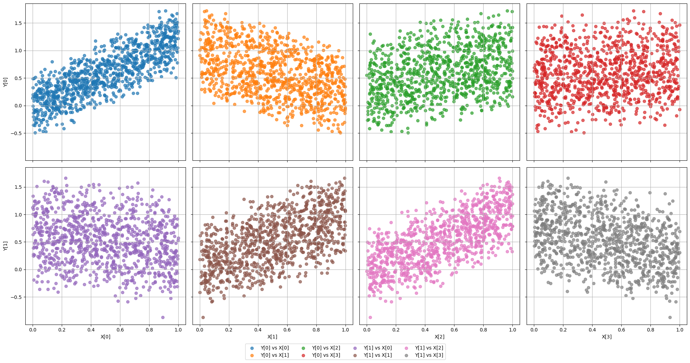
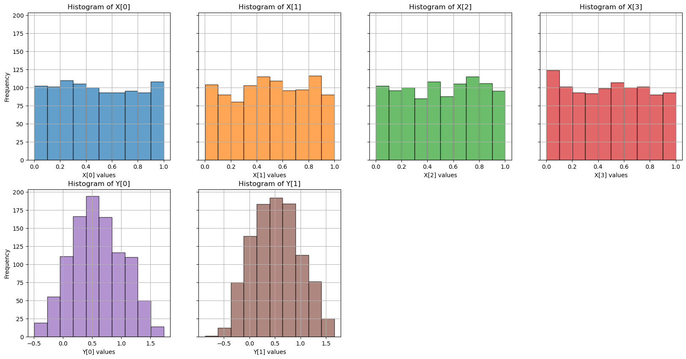

# DS-AFFINE-LINEAR-000: One-Layer Linear Teacher

<PageMeta />
---

## Summary

This is the baseline synthetic regression dataset for the first global-throttle ablations. It is intentionally simple so the Hessian and stability boundary are analytically interpretable.

| Field | Value |
|---|---|
| Dataset ID | `DS-AFFINE-LINEAR-000` |
| Family | Affine / linear teacher |
| Task | Regression |
| Input dimension | `d_in = 4` |
| Output dimension | `d_out = 2` |
| Bias | Disabled |
| Default samples | `N = 1000` |
| Default drift | `x_drift = gamma x`, with `gamma = 4` in EXP-000A and EXP-000B |

## Generation

Inputs are sampled as:

```math
x \sim \mathcal{U}([0,1]^{4}).
```

Targets are generated by:

```math
y = A x.
```

The default teacher matrix is:

```math
A =
\begin{bmatrix}
1.25 & -0.75 & 0.50 & 0.20 \\
-0.40 & 0.90 & 1.10 & -0.60
\end{bmatrix}.
```

So:

```math
\begin{bmatrix}
y_1\\
y_2
\end{bmatrix}
=
\begin{bmatrix}
1.25 & -0.75 & 0.50 & 0.20 \\
-0.40 & 0.90 & 1.10 & -0.60
\end{bmatrix}
\begin{bmatrix}
x_1\\
x_2\\
x_3\\
x_4
\end{bmatrix}.
```

### Code to generate the dataset:

If you need to understand the structure of this dataset, check [here](../implementation/dataset.md).

```python
import enabol 
# Create the dataset
dataset = enabol.AffineDataset(num_samples=1000, use_bias=False)
# Plot it 
dataset.plot()
dataset.plot_histogram()
print(dataset)

# Get the data
X, Y = dataset.get()
```

which renders:
<Terminal
  title="dataset summary"
  content={`AffineDataset(
  [Input] X: 
    Shape: (1000, 4)
    Dtype: DataType.D2_FLOAT
    X <- Uniform(-1, 1)
 [Output] Y: 
    Shape: (1000, 2)
    Dtype: DataType.D2_FLOAT
    Y <- X @ A.T + b
  ---------------------------------
  A = [[ 1.25 -0.75  0.5   0.2 ]
       [-0.4   0.9   1.1  -0.6 ]]
  b = [0. 0.]
  ---------------------------------
  Analytic Hessian:
    Lambda max: 1.0841
    Eta max: 1.8448
)`}
/>

The following image shows scatter plots of the input $x$ and target $y$ distributions, as well as their histograms at the bottom.





## Drift Model

The first drift model is pure input-gain drift:

```math
x_{\mathrm{drift}} = \gamma x.
```

For the first ablations:

```math
\gamma = 4.
```

The target remains consistent with the drifted input:

```math
y_{\mathrm{drift}} = A x_{\mathrm{drift}}.
```

This isolates curvature-driven closed-loop instability without changing the underlying teacher rule.

## Why This Dataset Exists

For one-layer no-bias linear regression, the loss is quadratic and the Hessian is tied to the input covariance. If the input is scaled by `gamma`, the dominant curvature grows approximately as:

```math
\lambda_{\max}(H_{\mathrm{drift}})
\approx
\gamma^2
\lambda_{\max}(H_{\mathrm{nom}}).
```

That makes this dataset useful for checking whether a controller reacts coherently when a learning rate that was stable before drift becomes unstable after drift.

## Used By

| Experiment | Role |
|---|---|
| [EXP-000A](../experiments/exp-000a-global-throttle-float-lin1.md) | Float global-throttle sanity check. |
| [EXP-000B](../experiments/exp-000b-global-throttle-qfx-lin1.md) | Quantized global-throttle sanity check. |

## Implementation

Implemented by `AffineDataset` in the dataset module.

Reference: [Dataset implementation](../implementation/dataset.md)
