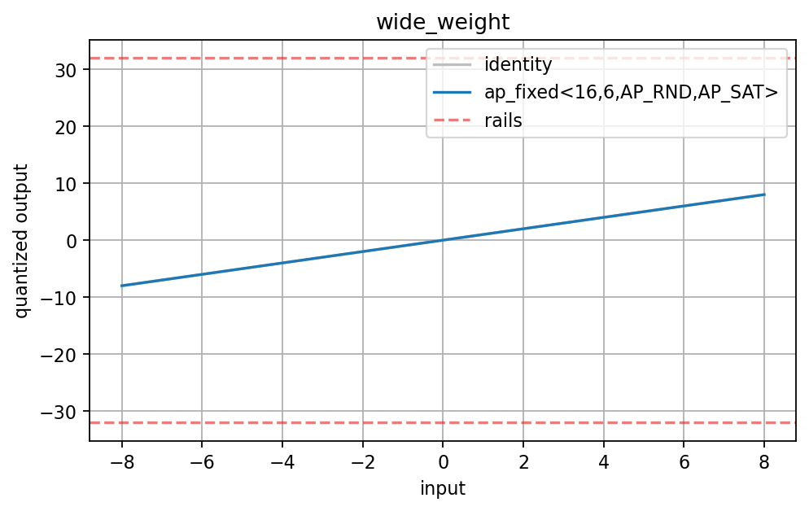
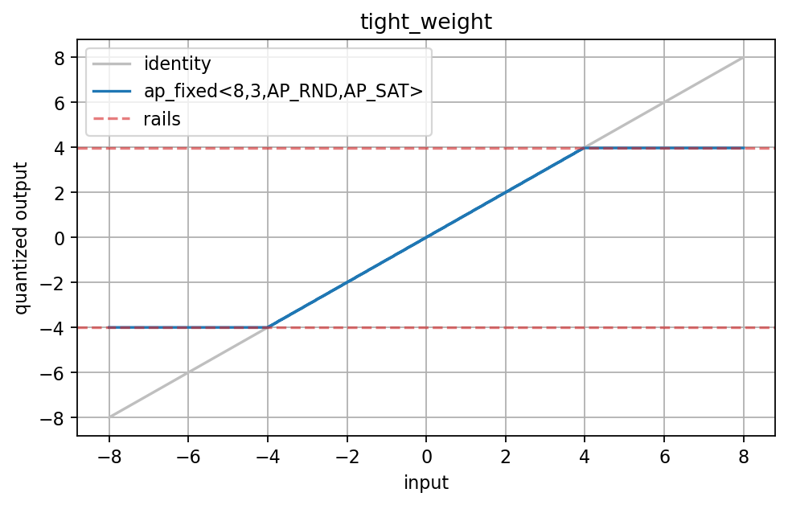
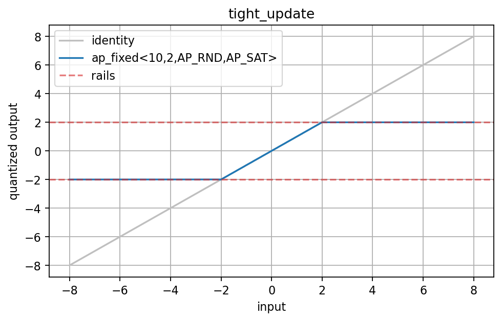
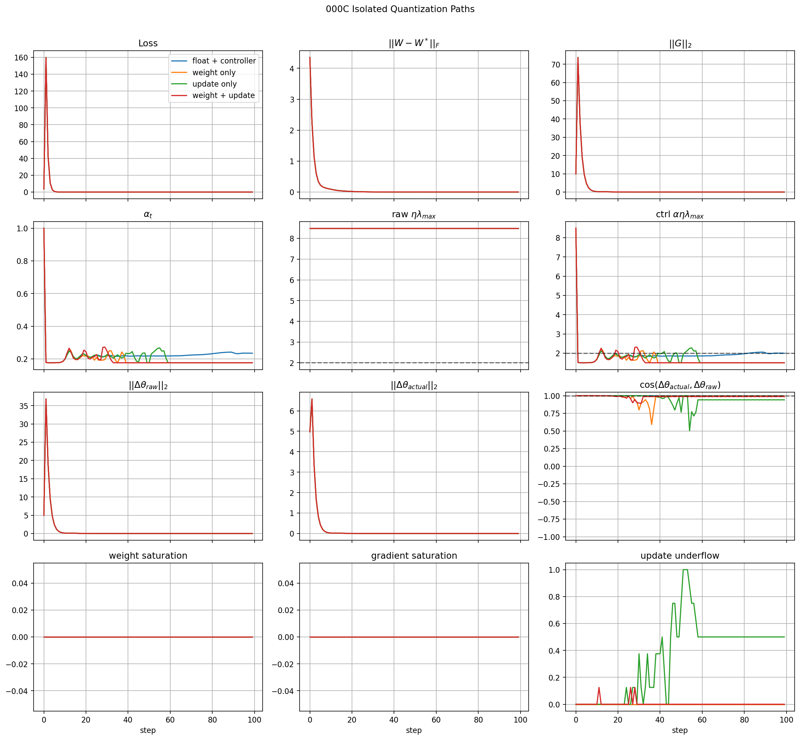
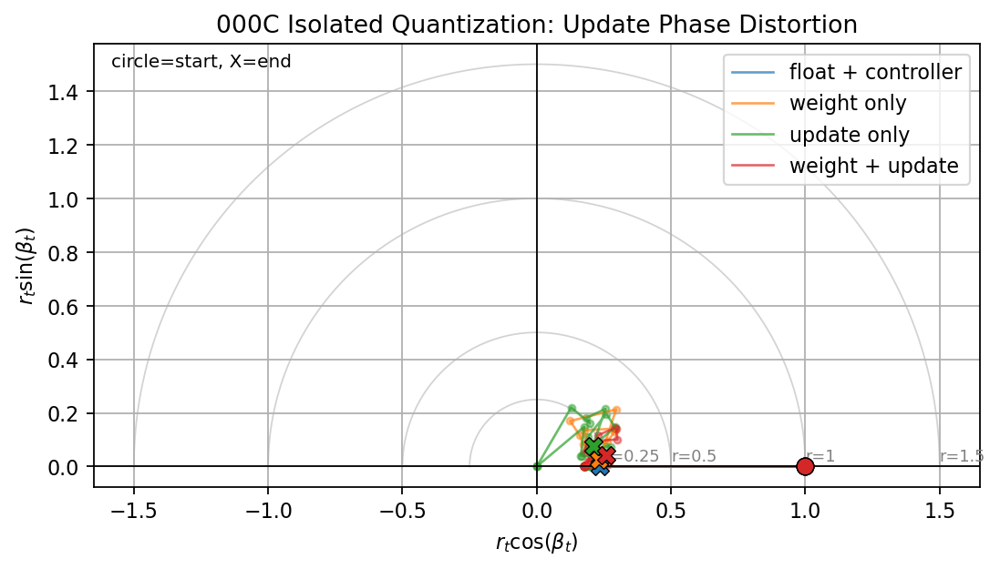
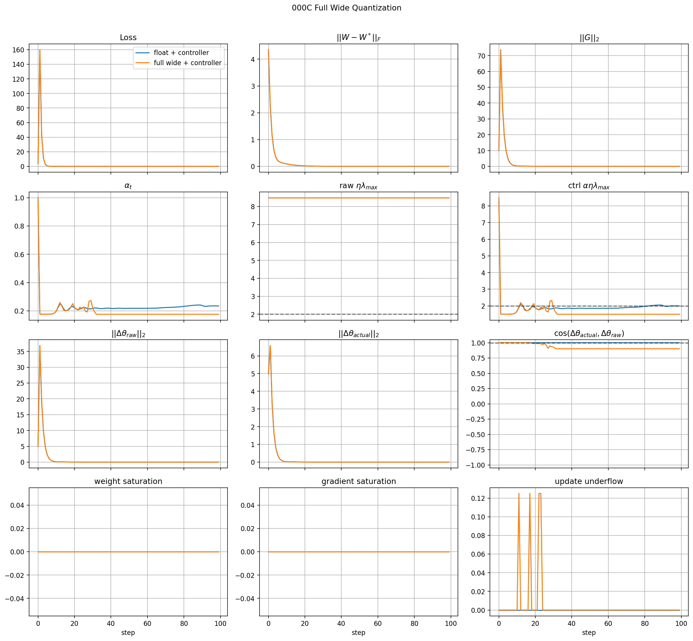
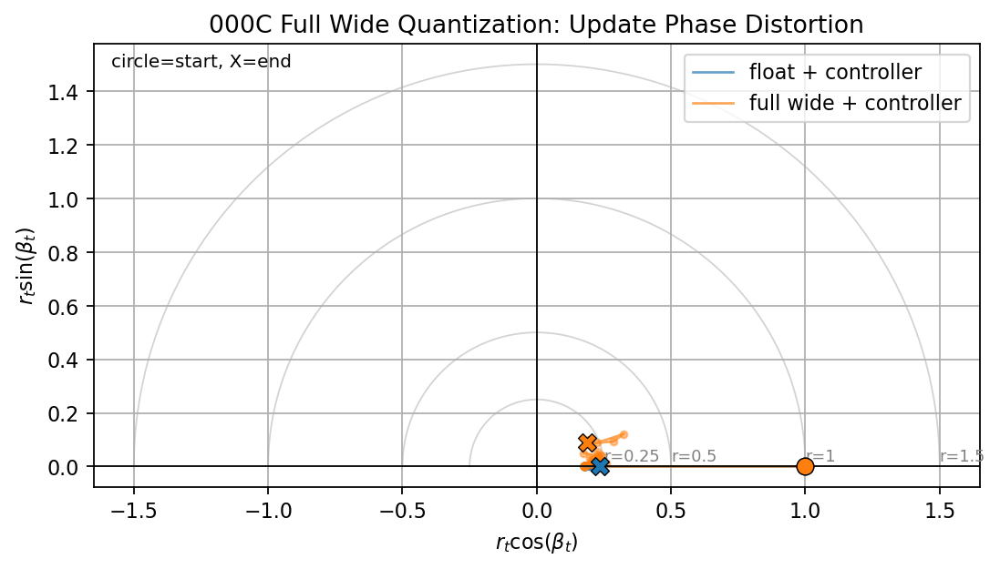
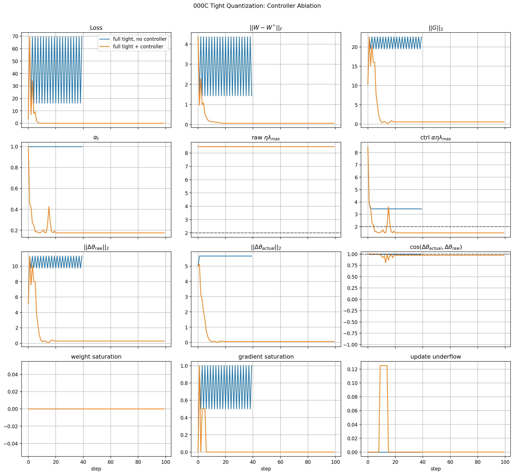
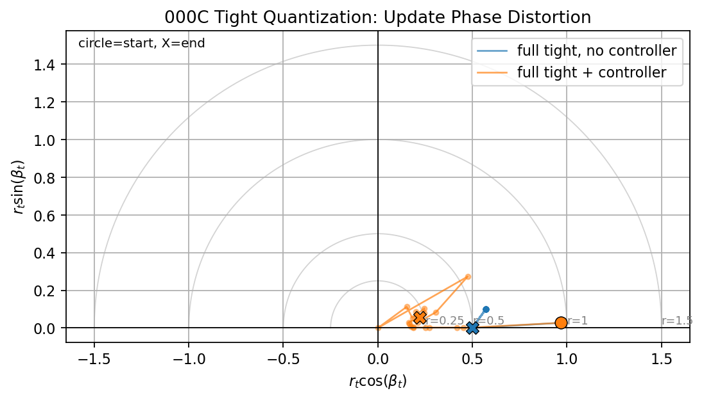

# Experiment 000C: Global Throttle With Quantization

<p className="status-line">
  Status:
  <span className="status-badge status-badge--preliminary">Preliminary</span>
  <span className="status-badge status-badge--valid">Valid</span>
</p>
Workspace: `workspace/ablations/000_global_throttle_sanity/`  
Notebook: [`workspace/ablations/000_global_throttle_sanity/notebooks/affine_drift_quantization_sanity.ipynb`](https://github.com/manuelblancovalentin/kappa_budgeting/blob/main/workspace/ablations/000_global_throttle_sanity/notebooks/affine_drift_quantization_sanity.ipynb)  
Starting point: [Experiment 000](./000-global-throttle-sanity.md)

## Purpose

Experiment 000 showed that a dynamic global throttle can stabilize a one-layer floating-point online learning loop after input-gain drift. Experiment 000C adds the first hardware-style numerical effects:

- finite precision weights,
- finite precision updates,
- optional finite precision activations,
- clipping or wrapping at fixed-point rails,
- saturation and underflow diagnostics.

The goal is not yet to reproduce the full ENABOL firmware path. The goal is narrower:

> Can the same global throttle stabilize a one-layer online learner when the update path is fake-fixed-point and the failure mode is numerical saturation, update underflow, or both?

## Base System

We keep the same one-layer no-bias teacher/student system:

```math
x \sim \mathcal{U}([0,1]^{d_{\mathrm{in}}})
```

```math
y = Ax
```

```math
\hat{y} = Wx
```

with loss:

```math
\mathcal{L}
=
\frac{1}{2N}
\left\|
\hat{Y}-Y
\right\|_F^2.
```

The nominal online update is:

```math
\Delta W_{\mathrm{raw}}(t)
=
-\eta G_W(t).
```

The controlled floating-point update is:

```math
\Delta W_{\mathrm{ctrl}}(t)
=
-\alpha_t \eta G_W(t).
```

Experiment 000C replaces parts of this update with fake-fixed-point operators.

## Fixed-Point Operator

A signed fixed-point type is described as:

```text
ap_fixed<WL, IWL, QMODE, OMODE>
```

where:

- `WL` is the total word length,
- `IWL` is the integer word length including the sign bit,
- `F = WL - IWL` is the number of fractional bits,
- `q = 2^{-F}` is the quantization step,
- `QMODE` controls rounding,
- `OMODE` controls overflow behavior.

For a signed fixed-point type, the real-valued rail interval is approximately:

```math
x_{\min}
=
-2^{IWL-1}
```

```math
x_{\max}
=
2^{IWL-1}-2^{-F}.
```

The fake-fixed-point quantizer is:

```math
Q_T(x)
=
q \cdot
\operatorname{overflow}_{T}
\left(
\operatorname{round}_{T}
\left(
\frac{x}{q}
\right)
\right).
```

For saturation mode:

```math
\operatorname{overflow}_{T}(z)
=
\operatorname{clip}
\left(
z,
-2^{WL-1},
2^{WL-1}-1
\right).
```

For wrap mode, the integer value wraps modulo:

```math
2^{WL}.
```

The first ablation should use saturation mode first:

```text
OMODE = AP_SAT
```

because saturation is easier to interpret than two's-complement wraparound.

## Quantized Training Equations

The first fake-fixed-point update path should be explicit and staged. A useful general form is:

```math
W_q(t)
=
Q_W(W(t)).
```

```math
\hat{y}_q(t)
=
Q_Y
\left(
Q_{\mathrm{acc}}
\left(
Q_X(x_t) W_q(t)^T
\right)
\right).
```

The gradient is computed from the quantized forward path:

```math
G_q(t)
=
\nabla_W
\mathcal{L}
\left(
\hat{y}_q(t),
y_t
\right).
```

The global throttle is computed as in Experiment 000:

```math
C_t
=
\frac{
\left\|G_q(t)-G_q(t-1)\right\|_2
}{
\left\|W(t)-W(t-1)\right\|_2+\varepsilon
}.
```

```math
\alpha_t
=
\min
\left(
1,
\frac{\chi}{\eta C_t^{\mathrm{ctrl}}+\varepsilon}
\right).
```

Then the quantized update is:

```math
\Delta W_q(t)
=
Q_{\Delta}
\left(
-\alpha_t\eta G_q(t)
\right).
```

and the stored weight becomes:

```math
W(t+1)
=
Q_W
\left(
W(t)+\Delta W_q(t)
\right).
```

This is the main software model of the hardware update path.

## Useful Learning Interval

Quantization introduces a lower bound on the useful update size. If the update quantum is:

```math
q_{\Delta}
=
2^{-F_{\Delta}},
```

then a rough useful-update condition is:

```math
\alpha_t \eta \left\|G_q(t)\right\|_2
\gtrsim
q_{\Delta}.
```

Stability still gives an upper bound:

```math
\alpha_t \eta C_t^{\mathrm{ctrl}}
\le
\chi.
```

So useful stable fixed-point learning requires a nonempty interval:

```math
\boxed{
\frac{
q_{\Delta}
}{
\eta\left\|G_q(t)\right\|_2+\varepsilon
}
\lesssim
\alpha_t
\le
\frac{
\chi
}{
\eta C_t^{\mathrm{ctrl}}+\varepsilon
}.
}
```

This is one of the main quantities to log in Experiment 000C.

## Rail Statistics

For each quantized tensor `z`, log:

```math
r_{\mathrm{sat}}(z)
=
\frac{
\#\{i: z_i \le z_{\min} \;\lor\; z_i \ge z_{\max}\}
}{
\#\{i: z_i\}
}.
```

Also log near-rail pressure:

```math
r_{\mathrm{near}}(z)
=
\frac{
\#\{i: |z_i| \ge \rho z_{\max}\}
}{
\#\{i: z_i\}
},
\qquad
0<\rho<1.
```

The first value of `rho` should be:

```math
\rho = 0.95.
```

Track these for:

- inputs,
- activations,
- weights,
- gradients,
- raw updates,
- applied quantized updates,
- outputs.

## Implementation Plan

The first implementation should not be a custom Keras layer. Use quantizer hooks in the custom training loop first.

The reason is diagnostic control. We need to turn quantization on and off independently for each tensor family:

| Hook | Tensor | First purpose |
|---|---|---|
| `input_quantizer` | `x` | Model sensor/input precision. |
| `weight_quantizer` | `W` | Model stored parameter precision. |
| `activation_quantizer` | `y_hat` or intermediate activations | Model forward rails. |
| `gradient_quantizer` | `G` | Model backward-path precision. |
| `update_quantizer` | `alpha * eta * G` | Model optimizer/update precision. |
| `accumulator_quantizer` | dot-product accumulator | Model MAC accumulation rails. |

The training loop should expose a layer-indexed `PrecisionDict`, not a flat config object. This keeps the experiment explicit now and scales to multilayer precision allocation later:

```python
from kappa import dtypes, PrecisionDict

precisions = PrecisionDict({
    "input": {
        "value": dtypes.ap_fixed(WL=12, IWL=4, QMODE="AP_RND", OMODE="AP_SAT"),
    },
    "dense0": {
        "weight": dtypes.ap_fixed(WL=12, IWL=4, QMODE="AP_RND", OMODE="AP_SAT"),
        "bias": None,
        "activation": dtypes.ap_fixed(WL=12, IWL=5, QMODE="AP_RND", OMODE="AP_SAT"),
        "gradient": dtypes.ap_fixed(WL=16, IWL=6, QMODE="AP_RND", OMODE="AP_SAT"),
        "update": dtypes.ap_fixed(WL=16, IWL=4, QMODE="AP_RND", OMODE="AP_SAT"),
        "accumulator": dtypes.ap_fixed(WL=24, IWL=10, QMODE="AP_RND", OMODE="AP_SAT"),
    },
    "loss": {
        "value": dtypes.ap_fixed(WL=24, IWL=12, QMODE="AP_RND", OMODE="AP_SAT"),
    },
})
```

Then pass it to the trainer:

```python
h = model.train_instrumented(
    X,
    Y,
    learning_rate=0.5,
    use_controller=True,
    precision_dict=precisions,
)
```

If `precision_dict=None`, the same trainer uses the original floating-point path.

The minimum training-loop shape is:

```text
for step in online_steps:
    x_q = Qx(x)
    W_q = Qw(W)

    with GradientTape:
        y_hat = model_forward(x_q, W_q)
        y_hat_q = Qy(y_hat)
        loss = mse(y, y_hat_q)

    G = gradient(loss, W)
    G_q = Qg(G)

    alpha = global_throttle(W, G_q, W_prev, G_prev)
    delta_raw = -alpha * eta * G_q
    delta_q = Qdelta(delta_raw)

    W_next = Qw(W + delta_q)
    assign(W_next)

    log(loss, alpha, rails, norms, update_cosine)
```

Later, after the quantization semantics stabilize, we can move some of this into reusable layers or model wrappers.

## Experiment Matrix

### 000C.0: Float Reproduction

Repeat Experiment 000 with quantization disabled.

Expected result:

| Metric | Expected |
|---|---|
| Loss | Matches Experiment 000. |
| `alpha_t` | Drops after drift. |
| Saturation | Exactly zero. |
| Update cosine | Near 1. |

This run is reproduced inside the comparison figures below as the floating-point reference curve.

### 000C.1: Weight Quantization Only

Enable:

```text
Q_W
```

Disable:

```text
Q_X, Q_Y, Q_G, Q_Delta, Q_acc
```

Purpose: isolate whether stored weight precision alone prevents convergence.

Expected result:

| Metric | Expected |
|---|---|
| Loss | Converges to a quantization floor. |
| Weight error | Stops near the nearest representable `W`. |
| Saturation | Low unless rails are too tight. |
| `alpha_t` | Similar to float unless quantization creates sharp jumps. |

### 000C.2: Update Quantization Only

Enable:

```text
Q_{\Delta}
```

Purpose: identify update underflow and dead learning.

Expected result:

| Metric | Expected |
|---|---|
| Loss | May plateau when updates underflow. |
| Applied update norm | Can collapse to zero. |
| Useful interval | Lower bound may exceed upper bound. |
| `alpha_t` | Too-small `alpha_t` may stabilize but also kill learning. |

### 000C.3: Weights Plus Updates

Enable:

```text
Q_W,\quad Q_{\Delta}
```

Purpose: model the minimum realistic parameter/update path.

Expected result:

| Metric | Expected |
|---|---|
| Loss | Stable if precision is sufficient. |
| Saturation | Low for wide rails. |
| Update cosine | Near 1 before clipping; lower if update quantization is coarse. |

### 000C.4: Full Fake-Fixed-Point Path With Wide Rails

Enable:

```text
Q_X,\quad Q_W,\quad Q_Y,\quad Q_G,\quad Q_{\Delta},\quad Q_{\mathrm{acc}}
```

Use wide rails first.

Purpose: confirm that quantization noise alone does not break the controller.

Expected result:

| Metric | Expected |
|---|---|
| Loss | Stable with a quantization floor. |
| Saturation | Near zero. |
| `alpha_t` | Similar to float, possibly noisier. |

### 000C.5: Full Fake-Fixed-Point Path With Tight Rails

Use intentionally tight rails to create saturation.

Purpose: test whether the global throttle prevents divergence when the numerical path is near hardware limits.

Expected result:

| Metric | Expected |
|---|---|
| Loss without throttle | Divergence, plateau, or rail-locking. |
| Loss with throttle | More stable, but may not recover if information is clipped away. |
| Saturation | Nonzero and correlated with instability. |
| Useful interval | May become empty in extreme cases. |

## Plots To Produce

Each run should produce:

1. Loss and RMSE versus step.
2. Weight error versus step.
3. Weight, gradient, and update norms.
4. Curvature proxy and EMA.
5. `alpha_t` and effective learning rate.
6. Raw and throttled stability margins.
7. Saturation fraction by tensor.
8. Near-rail fraction by tensor.
9. Raw and applied update norms.
10. Update underflow fraction.
11. Update cosine between intended and actual applied update.
12. Update phase distortion portrait.
13. Useful lower/upper bounds for `alpha_t`.

## Interpretation Rules

If the throttled run stays stable but reaches a nonzero error floor, that is acceptable. It means quantization is limiting accuracy but not destabilizing the loop.

If the throttled run is stable but the applied update norm becomes zero, that is not success. It means the controller avoided divergence by killing learning.

If activation or input rails clip heavily, recovery may be impossible because the target information has been destroyed before the optimizer sees it.

If update cosine drops far below 1, the quantization or clipping path is changing the descent direction. That is the same diagnostic we eventually want for legacy row/column kappa projection.

The update phase portrait is an offline diagnostic, not a proposed hardware controller signal. It visualizes the same update distortion as a complex point:

```math
\beta_t
=
\arccos(c_t)
```

```math
r_t
=
\frac{
\left\|\Delta\theta_{\mathrm{actual}}\right\|_2
}{
\left\|\Delta\theta_{\mathrm{raw}}\right\|_2+\varepsilon
}
```

```math
p_t
=
r_t e^{i\beta_t}.
```

Ideal updates stay near the positive real axis. Update underflow collapses the radius toward zero. Direction distortion pushes the trajectory away from the axis.

## Results

### Summary

The first run of Experiment 000C supports the fake-fixed-point implementation and the global-throttle hypothesis:

- the dtype transfer plots match the expected fixed-point rails,
- isolated weight/update quantization still converges under the controller,
- full wide-rail fake-fixed-point training behaves almost like the floating-point reference,
- full tight-rail fake-fixed-point training fails without the controller through a rail-driven oscillation,
- the global throttle stabilizes the same tight-rail run and drives the loss and weight error back near zero.

The most important finding is that the tight no-controller failure is not just ordinary curvature instability. It is a quantized closed-loop failure with heavy gradient saturation. The controller reduces the effective learning rate enough to keep the quantized update map usable.

The comparison figures now include the two update-geometry diagnostics needed to read this result correctly:

- `actual_update_norm`, which distinguishes real stabilized learning from silent update death,
- `update_cosine`, which checks whether the applied quantized update still points in the same direction as the intended raw update.

These panels are part of the regenerated PNGs used below.

The notebook also generates phase-distortion figures for the isolated, wide, and tight quantized comparisons.

### Dtype Transfer Validation

The first check validates the scalar quantizers directly.



`ap_fixed<16,6,AP_RND,AP_SAT>` has rails far outside the tested interval, so the quantized transfer curve follows the identity line. This is the expected wide-rail behavior.



`ap_fixed<8,3,AP_RND,AP_SAT>` clips near:

```math
[-4,\; 4-2^{-5}].
```

The transfer curve saturates at both rails, which confirms that the weight quantizer is enforcing the expected representable interval.



`ap_fixed<10,2,AP_RND,AP_SAT>` clips near:

```math
[-2,\;2-2^{-8}].
```

This is intentionally tight for an update type. It is useful because it lets the ablation expose update clipping and underflow.

### Isolated Quantization Paths



This figure compares:

- floating point with controller,
- weight quantization only,
- update quantization only,
- weight plus update quantization.

All four runs converge. The curves nearly overlap in loss, weight error, and gradient norm. This means the basic `PrecisionDict` hooks are not breaking the training loop.

The update-only run does show update underflow later in training. That is expected: as gradients become small, some quantized updates fall below the update quantum. In this run the underflow is not fatal because the model has already reached the stable region.

The new update-geometry panels make that distinction clearer. The applied update norm decays with the loss and weight error, and the update-only cosine degrades mainly in the late low-gradient regime where update underflow is active. That is different from an early instability where the update direction is corrupted before the model has learned.



The phase portrait shows the same behavior geometrically. The well-behaved paths stay close to the positive real axis. The update-only path moves inward and away from the axis later in training, matching the update-underflow and cosine diagnostics.

Important interpretation:

```text
isolated quantization is not yet the hard failure mode
```

The system still learns when only weights and/or updates are quantized with the selected wide formats.

### Full Wide-Rail Fake-Fixed-Point Path



This run turns on the full fake-fixed-point path with wide rails:

```math
Q_X,\quad Q_W,\quad Q_Y,\quad Q_G,\quad Q_{\Delta},\quad Q_{\mathrm{acc}}.
```

The wide fake-fixed-point run tracks the floating-point reference almost exactly:

- loss converges,
- weight error converges,
- gradient norm decays,
- weight and gradient saturation stay at zero,
- update underflow is only a small transient.

This is a useful sanity result. It says the fake-fixed-point path is not introducing an artificial failure when the rails and fractional precision are generous.



The wide-rail phase portrait stays close to the floating-point reference. This is the expected behavior when quantization does not significantly clip or rotate the applied update.

### Full Tight-Rail Controller Ablation



This is the first hardware-style failure case.

Without the controller, the tight quantized run enters a limit-cycle-like instability:

- loss oscillates between high and lower values,
- weight error oscillates instead of converging,
- gradient norm remains large,
- gradient saturation is often very high.

This means the failure mode is not only:

```math
\eta\lambda_{\max}(H)>2.
```

It is also a rail-driven quantized learning failure. The gradient path is repeatedly hitting the fixed-point limits, so the optimizer is no longer following a smooth floating-point update field.

With the controller enabled:

- the initial transient is still visible,
- `alpha_t` drops and then oscillates as the quantized dynamics settle,
- loss converges near zero,
- weight error converges near zero,
- gradient norm decays,
- sustained gradient saturation disappears,
- update underflow is not the dominant final failure mode.

The controlled tight run is therefore a meaningful success for this first ablation. The controller does not merely freeze learning; it lets the model continue adapting while keeping the quantized closed loop bounded.

The refreshed figure should be read with the update panels as follows:

- `actual_update_norm` should remain nonzero during recovery; otherwise the controller is only stopping the system by stopping learning.
- `update_cosine` should remain close to 1 for the global throttle path, except where quantization clips or underflows the applied update.
- A drop in `update_cosine` is evidence that the numerical path is changing the descent direction, which is the same diagnostic we will use later against row/column projection.

In this tight-rail run, `actual_update_norm` is large during the recovery transient and then decays as the loss and gradient norm decay. The controlled run is therefore not just immediately frozen. However, `update_cosine` drops and oscillates after the initial recovery, which shows that the tight quantized update path no longer preserves the raw descent direction perfectly in the low-gradient regime. That is acceptable for this stress test, but it is exactly the kind of distortion we need to track when choosing realistic update precision.



The tight-rail phase portrait makes the update distortion easier to see. The no-controller path stays at a compressed but nonzero radius while the loss oscillates. The controlled path moves inward as the model recovers, but it does not remain perfectly on the real axis. That residual angular motion is the quantized update-direction distortion seen in the cosine panel.

### Conclusions

The results support three conclusions:

1. The fake-fixed-point machinery is behaving correctly at the scalar dtype level and at the training-loop level.
2. Wide fake-fixed-point precision preserves the floating-point controller behavior.
3. Tight fake-fixed-point precision creates a rail-driven instability that the global throttle substantially stabilizes.

<div class="summary-box">
    <strong>Key takeaway:</strong> The controller is doing something useful. It is not just instantly freezing learning.

    The caveat is the update cosine panel. In the tight controlled run, cosine drops and oscillates after recovery. That means the tight quantized update path is no longer preserving the raw descent direction perfectly, especially once gradients are small. This is not fatal here because the model has already recovered, but it tells us the update dtype is probably too tight for clean late-stage learning.

    One more caveat: the controlled stability margin alpha eta lambda_max is not always below 2 after the transient. For the simple quadratic theory, staying below 2 is the clean stability condition. The fact that the run still converges means the actual quantized nonlinear loop is more complicated than the pure float Hessian story. We should keep plotting this, but we should not claim the controller strictly enforces the quadratic GD bound in the tight quantized case.

    Bottom line: this experiment is successful. It validates the quantization hooks, creates a meaningful tight-rail failure, and shows that the global throttle stabilizes it. The main next lesson is that “stable” is not enough: we also need update cosine and actual update norm to detect whether precision is preserving useful learning geometry.
</div>
