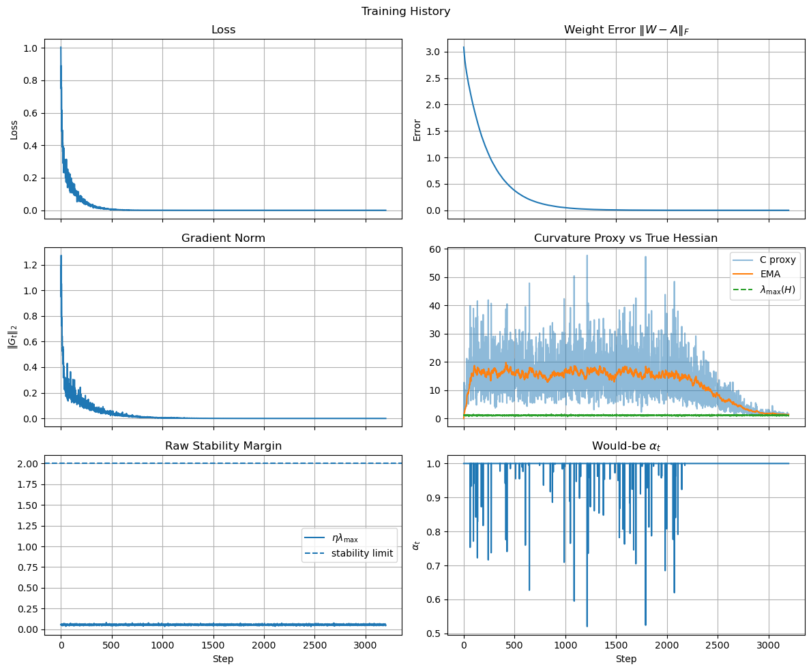
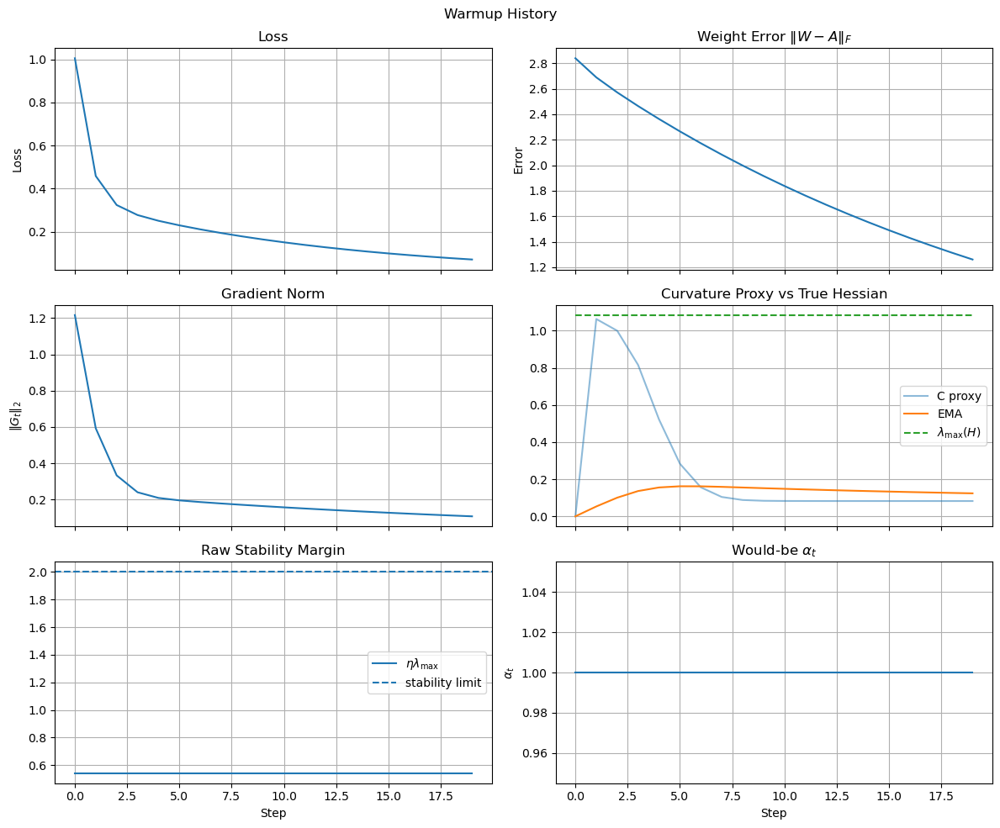
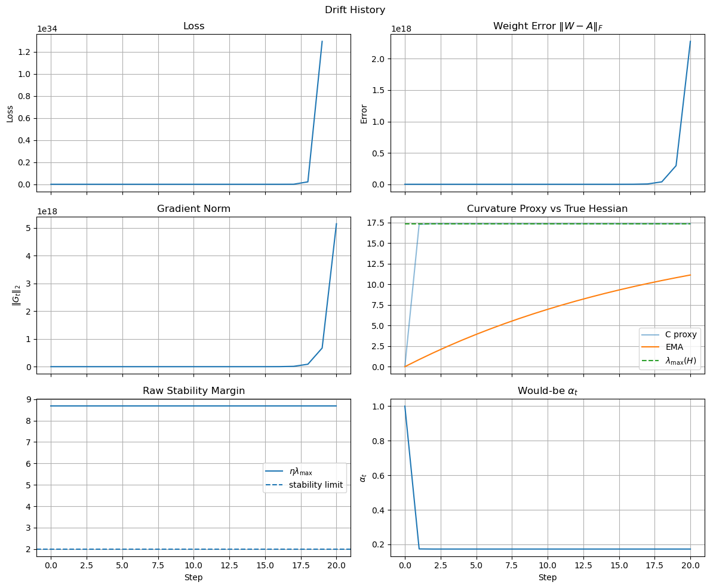
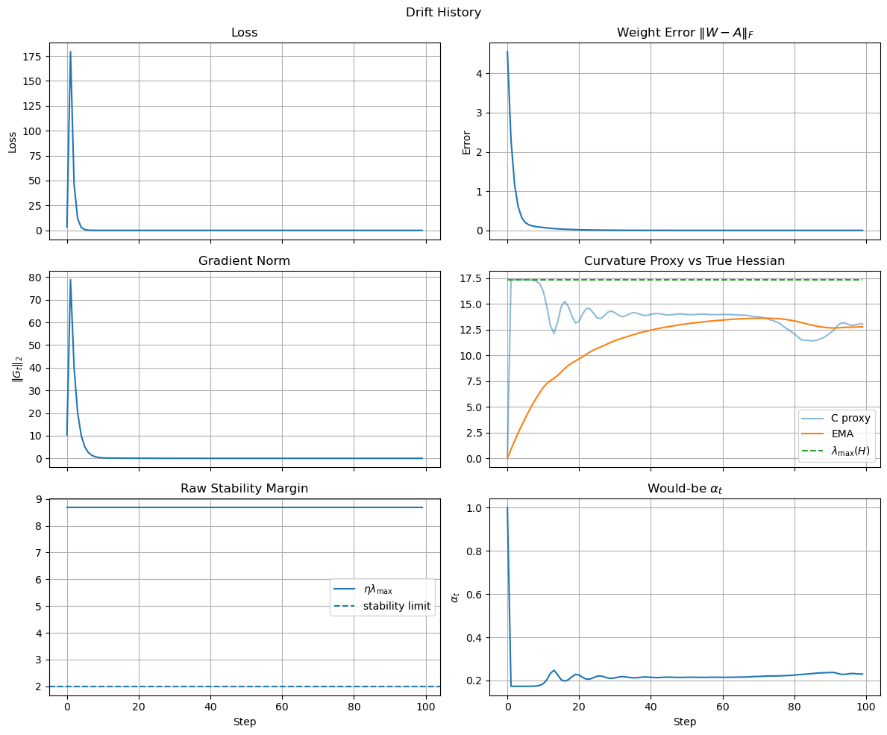

# EXP-000A: Global Throttle Float LIN1

<PageMeta />

---

## Experiment Trace

| Field | Value |
|---|---|
| Dataset | [`DS-AFFINE-LINEAR-000`](../datasets/affine-linear-000.md) |
| Model | [`MDL-DENSE1-LINEAR-NOBIAS-000`](../models/dense1-linear-nobias-000.md) |
| Training method | Dynamic global throttle, SGD-style online loop |
| Precision mode | Floating point |
| Drift | Input gain drift, $x' = \gamma x$, with $\gamma = 4$ |

## Purpose

This is the first working sanity check for the dynamic global throttle idea.

The goal is not yet to test quantization, fixed-point rails, multiple layers, or the full <ENABOL /> hardware path. The goal is narrower:

> Can we build a custom Keras training loop that detects unstable online learning dynamics and globally throttles the learning update so training does not diverge?

This test validates the instrumentation and controller on the simplest possible model.


### Code to generate the dataset:

If you need to understand the structure of this dataset, check [here](../implementation/dataset.md).

```python
import enabol 
# Create the dataset
dataset = enabol.AffineDataset(num_samples=1000, use_bias=False)

# Get the data
X, Y = dataset.get()
```

Note that the dataset object also contains the analytical hessian metrics. This is important because it means that:
```math
\begin{aligned}
\lambda_{\max}(H_{\text{nom}}) &\approx 1.0841 \\
\eta_{\max}^{\text{nom}}=\frac{2}{\lambda_{\max}(H_{\text{nom}})} &\approx 1.8448.
\end{aligned}
```

## Drift Model
Now let's assume a learning rate of $\eta=0.5$. With no drift, the nominal margin is:

```math
\eta\lambda_{\max}(H_{\text{nom}}) = 1.0841 \cdot 0.5
\approx 0.54 < 2.
```

However, with a gain drift of $\gamma=4$, the Hessian grows approximately as:
```math
\lambda_{\max}(H_{\text{drift}})
\approx \gamma^2\lambda_{\max}(H_{\text{nom}})
\approx 17.3456.
```

which means the post-drift margin is:

```math
\eta\lambda_{\max}(H_{\text{drift}})
\approx 8.6728 > 2
```

<TBox type="summary" title="Summary">
When drifting the input gain by a factor of 4, the previously stable learning rate of $0.5$ becomes unstable. This is the regime where we expect the global throttle controller to intervene and prevent divergence.
</TBox>

## Controller Behavior
Given the instability introduced by the drift, what we basically expect is that the controller should choose a throttle $\alpha_t$ such that the effective learning rate $\alpha_t \eta$ is back in the stable region. In other words, we expect:
```math
\alpha_t\approx \frac{\chi}{\eta C_t^{\text{ctrl}}}.
```

With $\chi=1.5$ the ideal post-drift throttle:

```math
\alpha^\star
\approx \frac{1.5}{8.6728}
\approx 0.173.
```

Then:
```math
\alpha_t\eta\lambda_{\max}(H_{\text{drift}})
\approx 1.5 < 2.
```

<TBox type="summary" title="Summary">
The global throttle reduces the optimal learning rate such that it stays in the stable region even after drift.
</TBox>

## Model
The student model is a one-layer linear network without bias:
```math
\hat{y} = Wx
```
This keeps the Hessian and closed-loop stability story simple.

### Code to build the model:
```python
model = enabol.LinearBlockModel(dataset=dataset, num_hidden=[dataset.A.shape[0]], 
                               activation=None, use_batchnorm=False, verbose=True, 
                               use_bias=False, seed=0)
model.summary()
```

which returns 

<Terminal
  title="model summary"
  content={`[INFO] - Building model with input shape (4,) and output shape (2,)
[INFO] - Added Dense layer with 2 units
Model: "LinearBlockModel"
┏━━━━━━━━━━━━━━━━━━━━━━━━━━━━━━━━━┳━━━━━━━━━━━━━━━━━━━━━━━━┳━━━━━━━━━━━━━━━┓
┃ Layer (type)                    ┃ Output Shape           ┃       Param # ┃
┡━━━━━━━━━━━━━━━━━━━━━━━━━━━━━━━━━╇━━━━━━━━━━━━━━━━━━━━━━━━╇━━━━━━━━━━━━━━━┩
│ input_layer (InputLayer)        │ (None, 4)              │             0 │
├─────────────────────────────────┼────────────────────────┼───────────────┤
│ dense (Dense)                   │ (None, 2)              │             8 │
└─────────────────────────────────┴────────────────────────┴───────────────┘
 Total params: 8 (32.00 B)
 Trainable params: 8 (32.00 B)
 Non-trainable params: 0 (0.00 B)`}
/>


## Current Notebook Flow

The notebook currently does three things:

1. Builds a controlled affine dataset.
2. Trains the one-layer model normally to confirm the task is learnable.
3. Reinitializes the model, performs a nominal warmup, then enters a drifted online phase:

```math
x_{\mathrm{drift}} = \gamma x
```

The notebook compares:

| Run | Controller | Purpose |
|---|---:|---|
| Nominal baseline | off | Confirm the one-layer model learns the teacher. |
| Drift baseline | off | Show unstable behavior after gain drift. |
| Drift controlled | on | Show the global throttle can prevent divergence. |

## What Is Being Tested

The custom trainer logs the quantities needed for closed-loop analysis:

- loss,
- RMSE,
- weight error,
- parameter norm,
- gradient norm,
- raw update norm,
- actual update norm,
- curvature proxy,
- curvature EMA,
- controller value `alpha(t)`,
- effective learning rate,
- Hessian eigenvalue estimates,
- stability margins,
- update-map spectral radius,
- finite/divergence flags.

The controller globally scales the SGD update:

```math
\Delta \theta_{\mathrm{actual}}(t)
=
\alpha(t)\Delta \theta_{\mathrm{raw}}(t)
```

where:

```math
0 < \alpha(t) \le 1
```

The important property is that this scaling should preserve the update direction while reducing the effective learning rate.


## EXP-000A.0: Sanity check without drift or quantization
Here we just make sure that our dataset and our model classes/objects are working as expected so we simply train them with a sane value for the learning rate, and without any drift. The code for this experiment:

```python
h = model.train_instrumented(
    X,
    Y,
    epochs=100,
    batch_size=32, #dataset.num_samples,  # Full-batch for clean Hessian metrics
    learning_rate=0.05,
    loss_mode="half_mse",
    curvature_ema_rho=0.05,
    chi=1.5,
    use_controller=False,
    compute_analytic_hessian=True,
    reference_A=dataset.reference_weight_matrix,
)
print(h)
h.plot_results(title="Training History")
```

The result is shown in the image below, which confirms that the loss curve is smooth and converges to zero, as expected, without any instability or divergence.




## EXP-000A.1: Drift without controller
Here we introduce a gain drift in the input:
```math
x' = \gamma x \qquad \leadsto \qquad y' = Ax'
```

so that the task remains consistent while the Hessian grows approximately as:

```math
\lambda_{\max}(H_{\mathrm{drift}})
\approx
\gamma^2 \lambda_{\max}(H_{\mathrm{nom}})
```

### Stage 0: Normal training without drift
First, we reintialize the model and run a nominal warmup phase to confirm that training starts in a stable regime. The code to generate this is:

```python
# Reinit
model.reinitialize_weights()

# Phase 1: nominal warmup
h_nom = model.train_instrumented(
    X,
    Y,
    epochs=20,
    batch_size=len(X),
    learning_rate=0.5,
    # highlight-next-line
    use_controller=False,
    reference_A=dataset.A,
)
h_nom.plot_results(title="Warmup History")
```

The result is shown in the image below, which confirms that the model learns the task and converges to zero loss in a stable way.



### Stage 1: drifted training without controller
Next, we introduce the gain drift and continue training without the controller to confirm that the training dynamics become unstable. The code to generate this is:

```python
# Phase 2: sensor gain drift
gamma = 4.0
Xd = gamma * X
Yd = Y # important: target remains clean

h_drift = model.train_instrumented(
    Xd,
    Yd,
    epochs=100,
    batch_size=len(Xd),
    learning_rate=0.5,
    use_controller=False,
    reference_A=dataset.A / gamma,
)

h_drift.plot_results(title="Drift History")
```

The result is shown in the image below, which confirms that the loss curve diverges after the drift is introduced, as expected.



## EXP-000A.2: Drift with controller
Finally, we run the same loop with the drifted data but now we turn on the controller to confirm that it can prevent divergence. The code to generate this is below (note that it's important that we reinitialize the model again to start from the same initial conditions as the previous runs, and that we use the same nominal warmup phase to give the controller a chance to estimate the curvature before the drift starts):

```python
# Reinit
model.reinitialize_weights()

# Phase 1: nominal warmup
h_nom = model.train_instrumented(
    X,
    Y,
    epochs=20,
    batch_size=len(X),
    learning_rate=0.5,
    use_controller=False,
    reference_A=dataset.A,
)

# Phase 2: sensor gain drift
h_drift = model.train_instrumented(
    Xd,
    Yd,
    epochs=100,
    batch_size=len(Xd),
    learning_rate=0.5,
    # highlight-next-line
    use_controller=True,
    reference_A=dataset.A / gamma,
)

h_nom.plot_results(title="Warmup History")
h_drift.plot_results(title="Drift History")
```

The result is shown in the image below, which confirms that the loss curve remains stable and converges to zero even after the drift is introduced, thanks to the global throttle controller.



## Summary of Results

<TBox type="summary" title="Summary">
<strong>Key Findings:</strong> This preliminary notebook supports the basic claim that a global controller can throttle the total learning rate and stabilize a one-layer online learning loop.
</TBox>


## Notebook Preview

The notebook can be viewed directly on GitHub:

<a href="https://github.com/manuelblancovalentin/kappa_budgeting/blob/102be154f09eef96536ea3dc6ca5ec7a16756979/workspace/ablations/exp_000_global_throttle_sanity/notebooks/exp_000a_global_throttle_float_lin1.ipynb" target="_blank" rel="noreferrer">Open notebook on GitHub</a>

<iframe
  src="https://nbviewer.org/github/manuelblancovalentin/kappa_budgeting/blob/102be154f09eef96536ea3dc6ca5ec7a16756979/workspace/ablations/exp_000_global_throttle_sanity/notebooks/exp_000a_global_throttle_float_lin1.ipynb"
  width="100%"
  height="900"
  style={{border: '1px solid var(--ifm-color-emphasis-300)', borderRadius: '6px'}}
  title="EXP-000A notebook preview"
/>

If the iframe does not load, use the GitHub link above.
