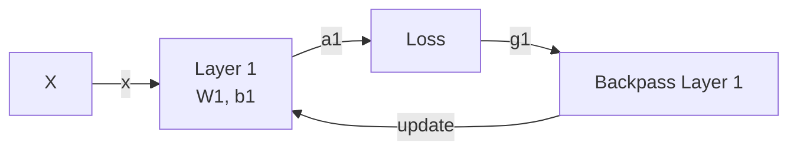

---
status:
  - draft
tags:
  - experiment
  - template
last_modified: 2026-05-15
author: mbvalentin
---
# Experiment Template

<PageMeta />

Copy this structure when documenting an ablation experiment.

## Experiment Title

Use this ID format:

```text
EXP-<number><variant>-<method>-<precision>-<model>
```

Examples:

```text
EXP-000A-GLTHR-FLOAT-LIN1
EXP-000B-GLTHR-QFX-LIN1
```

Date: YYYY-MM-DD  
Owner: NAME  
Status: Planned / Running / Done / Failed / Deprecated

## Goal

What question are we trying to answer?

## Hypothesis

What do we expect to happen?

## Setup

| Field | Value |
|---|---|
| Experiment ID | `EXP-...` |
| Branch | `branch-name` |
| Commit | `commit-hash` |
| Dataset ID | `DS-...` |
| Model ID | `MDL-...` |
| Precision map | Precision map / dtype registry entry |
| Drift | `(alpha, beta)` range |
| Budgeting variant | Variant |
| Optimizer | Optimizer |
| Environment | Environment |

## Dataset And Model References

Link to the dataset and model registry pages. Only restate equations here if the experiment changes or specializes them.

## Model Math

Add the forward equations and loss only when they are specific to this experiment.

```text
z1 = W1 x + b1
a1 = relu(z1)
y_hat = W2 a1 + b2
L = ...
```

## Diagram

Use Mermaid for the forward and backward paths.



## Procedure

1. Step 1
2. Step 2
3. Step 3

## Results

Add tables, plots, screenshots, or links to raw logs.

| Metric | Baseline | Budgeted |
|---|---:|---:|
| Final loss | TBD | TBD |
| Saturation events | TBD | TBD |
| Max throttle shift | TBD | TBD |
| Mean update cosine | TBD | TBD |

## Interpretation

What do the results mean?

## Failure modes / caveats

- Caveat 1
- Caveat 2

## Next steps

- [ ] Next action
- [ ] Next action

<Todo id="EXP-XXX-TODO-001" owner="open">
Describe one concrete task that a collaborator can pick up.
</Todo>

## Related links

- Issue:
- Pull request:
- Lab log:
- Notebook:
- Data:
