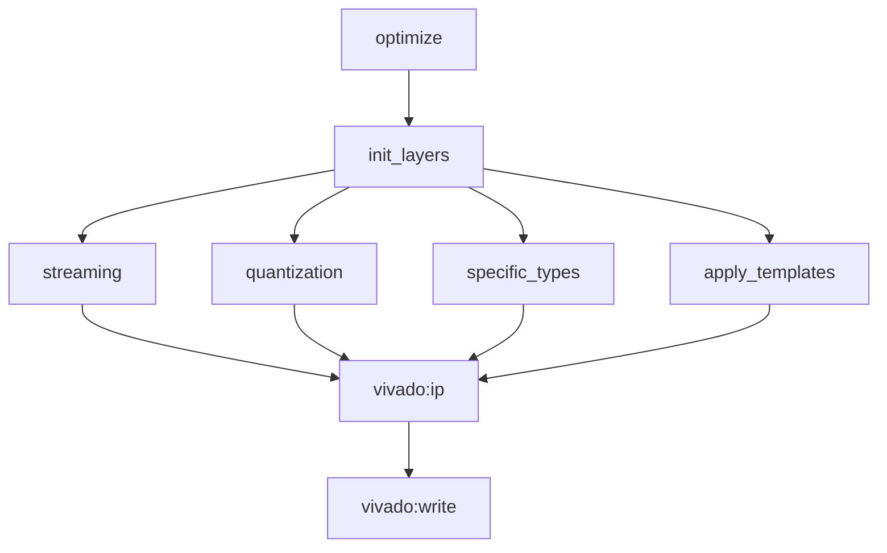

# ModelGraph and Flows
<PageMeta />
---

<TBox type="summary" title="Role">

`ModelGraph` owns the hls4ml graph. Flows are ordered groups of passes applied to that graph. Trainable behavior should enter hls4ml as an optional flow, not as a separate writer-side compiler.

</TBox>

## What hls4ml Does Today

The converter produces a layer list. `ModelGraph.from_layer_list()` creates an `HLSConfig`, builds input and output names, constructs graph nodes, then applies every flow listed in `model.config.flows`.

The default Vivado flow is registered by `VivadoBackend._register_flows()` and has this rough structure:



Important points:

- Flows are named and can depend on other flows.
- A flow can be a list of optimizer pass names or a function returning passes.
- The backend default flow ends before writing. Writing is a separate flow.
- Template application is itself a flow of optimizer passes that annotate layers.

## Why This Matters For Training

Backprop is a graph transformation/code-generation concern. It needs a finalized forward graph:

- final layer order
- final tensor names
- final output variables
- final precision names
- final layer config names
- final forward include headers

But it must run before the writer because it should populate attributes the writer can emit.

That implies a trainable flow should run after normal forward templates and before `vivado:write_hls`.

## Proposed Trainable Flow

Register a new backend flow in Vivado:

```text
vivado:trainable
  requires:
    vivado:ip
  passes:
    vivado:trainable_validate
    vivado:trainable_resolve_endpoints
    vivado:trainable_resolve_backward_chain
    vivado:trainable_precision_types
    vivado:trainable_loss_templates
    vivado:trainable_backward_templates
    vivado:trainable_controller_templates
```

Then make the writer flow depend on it only when `Model.Trainable` is true. There are two implementation options:

1. Register a trainable-specific default flow when config is trainable.
2. Always include the trainable flow, but make every pass no-op unless `Model.Trainable` is true.

The second option is simpler and easier to test because the flow graph stays stable.

## Do We Need a BackpassGraph?

Not first.

A separate backward graph is conceptually clean, especially for branches and multiple outputs. But it adds a new ownership problem: duplicated nodes, gradient variables, graph serialization, scheduling, and writer traversal. The current hls4ml architecture already supports attaching generated code to existing layers.

Recommended first pass:

```text
forward ModelGraph
  layer attributes:
    backward inputs
    backward outputs
    backward function_cpp
    backward config_cpp
  model attributes:
    loss endpoints
    controller state
    update schedule
```

Possible later pass:

```text
BackwardGraph
  explicit gradient nodes
  explicit loss nodes
  explicit update nodes
```

The later option should wait until sequential dense/conv/activation models are working cleanly.

## What The Trainable Flow Should Compute

The flow should compute these facts once:

| Fact | Owner |
|---|---|
| Which outputs have losses | model attribute |
| Which tensor feeds each loss | loss endpoint metadata |
| Which activation is skipped for from-logits losses | loss endpoint metadata |
| Reverse layer order | trainable pass local or model attribute |
| Which layer stops backprop | layer trainability attribute |
| Incoming gradient tensor name per layer | layer attribute |
| Outgoing gradient tensor name per layer | layer attribute |
| Required gradient casts | layer attribute or backward function snippet |
| Required backward include headers | layer attribute |
| Global controller/update state | model attribute |

The writer should not recalculate these.

