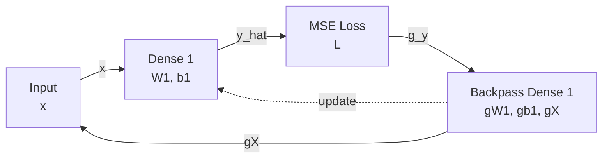
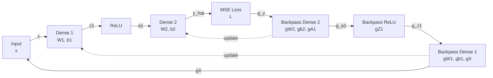

# Closed-Loop Ablation Architecture

The ablation harness should mirror the <ENABOL /> online training loop, but remain small enough to inspect every tensor and compute exact curvature diagnostics. The first implementation target is software simulation, not HLS synthesis.

## Training Loop

Each experiment follows the same high-level flow:

```text
1. Generate a controlled dataset.
2. Train a small floating-point or high-precision reference model.
3. Quantize or simulate fixed-point training with selected precisions.
4. Apply input drift.
5. Continue online training with one controller variant enabled.
6. Log loss, norms, curvature proxies, throttle, update geometry, saturation, and rails.
```

The online loop should operate on a flattened global parameter vector:

```text
theta = flatten(W1, b1, W2, b2, ...)
G     = flatten(dL/dW1, dL/db1, dL/dW2, dL/db2, ...)
```

This makes global controllers easy to implement and lets us measure whether a method preserves the intended update direction.

## Priority Controllers

Implement these first:

| Switch | Meaning |
|---|---|
| `controller=none` | Baseline online training. |
| `controller=dynamic_global_throttle` | Compute one scalar `alpha(t)` and scale the full update vector. |
| `controller=global_static_kappa_scale` | If global gain exceeds `K_max`, scale all layers by one shared scalar. |
| `controller=loose_kappa_plus_throttle` | Keep loose static rails and apply dynamic global throttle. |
| `precision` | Fixed-point format or simulated fixed-point rails. |

Legacy row/column kappa projection can be included later as `controller=legacy_row_col_projection` if it is already available or cheap to stub. It is not a first implementation requirement.

## Dynamic Global Throttle

At each online step:

<div className="pseudo">
  <div className="pseudo-title">Algorithm 1: DynamicGlobalThrottle</div>
  <div className="pseudo-code">

1. **input** current parameters $\theta(t)$, gradient $G(t)$, learning rate $\eta$
2. **input** previous parameters $\theta(t-1)$, previous gradient $G(t-1)$
3. $\Delta_{\mathrm{raw}}(t) \leftarrow -\eta G(t)$
4. $C(t) \leftarrow \dfrac{\lVert G(t) - G(t-1) \rVert}{\lVert \theta(t) - \theta(t-1) \rVert + \varepsilon}$ <span className="comment">curvature proxy</span>
5. $S(t) \leftarrow \operatorname{EMA}(C(t))$
6. $\alpha(t) \leftarrow \operatorname{clamp}\left(\dfrac{1}{1 + \beta S(t)}, \alpha_{\min}, 1\right)$
7. $\Delta_{\mathrm{actual}}(t) \leftarrow \alpha(t)\Delta_{\mathrm{raw}}(t)$
8. $\theta(t+1) \leftarrow \theta(t) + \Delta_{\mathrm{actual}}(t)$
9. **return** $\theta(t+1)$, $\alpha(t)$, $C(t)$

  </div>
  <div className="pseudo-caption">The scalar $\alpha(t)$ is shared globally across all layers.</div>
</div>

Because $\alpha(t)$ is global, it preserves the raw update direction:

```math
cos(\Delta_{\mathrm{actual}}, -G) \approx 1
```

unless fixed-point saturation, projection, or another mechanism distorts the update.

## Experiment 001: Single Dense Affine Regression

This is the minimum test case. It isolates closed-loop update stability without inter-layer interactions.



Math:

```math
x \sim U([0, 1]^d)
```

```math
y = Ax + c
```

```math
\hat{y} = W_1x + b_1
```

```math
L = \operatorname{mean}\left((\hat{y} - y)^2\right)
```

Backpass:

```math
g_y = \frac{\partial L}{\partial \hat{y}}
```

```math
g_{W_1} = x g_y^T
```

```math
g_{b_1} = g_y
```

```math
g_x = W_1^T g_y
```

Drift:

```text
x_drift = alpha x + beta
```

Primary question:

```text
Can dynamic global throttling keep online fixed-point training stable in a known linear system where the exact solution and Hessian are easy to inspect?
```

## Experiment 002: Two Dense Layers With ReLU

This introduces an intermediate activation and an inter-layer gradient path while still staying small enough to inspect.



Teacher model:

```math
y = A_2 \operatorname{relu}(A_1x + c_1) + c_2
```

Student model:

```math
z_1 = W_1x + b_1
```

```math
a_1 = \operatorname{relu}(z_1)
```

```math
\hat{y} = W_2a_1 + b_2
```

Backpass:

```math
g_y = \frac{\partial L}{\partial \hat{y}}
```

```math
g_{W_2} = a_1 g_y^T
```

```math
g_{b_2} = g_y
```

```math
g_{a_1} = W_2^T g_y
```

```math
g_{z_1} = g_{a_1}\,\mathbf{1}[z_1 > 0]
```

```math
g_{W_1} = x g_{z_1}^T
```

```math
g_{b_1} = g_{z_1}
```

```math
g_x = W_1^T g_{z_1}
```

Primary question:

```text
When there is an intermediate activation, can global throttling stabilize coupled layer dynamics without changing descent geometry?
```

## Comparison Variants

The first matrix should be small and should not require rebuilding the old row/column machinery:

| Variant | Required Now | Purpose |
|---|---:|---|
| Floating reference | yes | Establish expected behavior without fixed-point limits. |
| Fixed-point baseline | yes | Find regimes where online learning fails. |
| Dynamic global throttle | yes | Test closed-loop stabilization while preserving update geometry. |
| Loose kappa + throttle | yes | Test static safety rails plus dynamic control. |
| Global static kappa scale | yes | Test global gain control without row/layer direction changes. |
| Legacy row/column projection | optional | Compare against the old mechanism only if available or cheap to stub. |

The key comparison is baseline fixed-point versus dynamic global throttle. Legacy row/column projection is useful for diagnosing direction distortion, but it is secondary.

## Required Logs

Each run should produce machine-readable logs and notebook plots for:

- loss before and after drift,
- output error before and after drift,
- global and per-layer weight norms,
- global and per-layer gradient norms,
- global and per-layer update norms,
- curvature proxy `C(t)`,
- EMA instability signal `S(t)`,
- global throttle `alpha(t)`,
- update cosine between actual update and `-G`,
- activation min/max/percentiles per layer,
- gradient min/max/percentiles per layer,
- fixed-point saturation counts per tensor,
- rail pressure fractions per tensor,
- product gain or approximate forward gain,
- optional Hessian norm, `lambda_max(H)`, `rho(I - eta H)`, and `rho(I - alpha eta H)`.

The update cosine is important because it directly measures whether budgeting preserves descent direction:

```math
\cos(\theta)
=
\frac{
  \langle \Delta_{\mathrm{raw}}, \Delta_{\mathrm{budgeted}} \rangle
}{
  \lVert \Delta_{\mathrm{raw}} \rVert_2
  \lVert \Delta_{\mathrm{budgeted}} \rVert_2
}
```

Values near 1 mean budgeting mostly rescales the update. Lower or negative values mean budgeting has substantially changed the direction.

For dynamic global throttle alone, this value should stay near 1. If it does not, the fixed-point path or saturation logic is changing the update.
