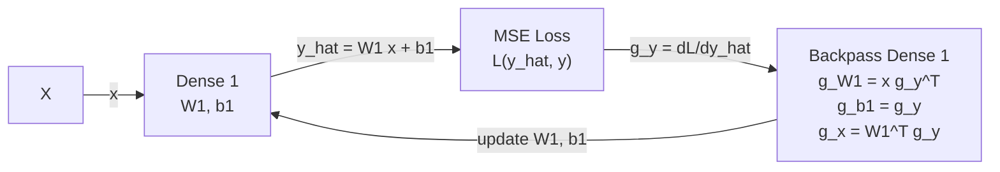

# Ablation Architecture

The ablation harness should mirror the ENABOL training loop, but remain small enough to inspect every tensor. The first implementation target is software simulation, not HLS synthesis.

## Training Loop

Each experiment follows the same high-level flow:

```text
1. Generate a controlled dataset.
2. Train a small floating-point or high-precision reference model.
3. Quantize or simulate fixed-point training with selected precisions.
4. Apply input drift.
5. Continue online training with one budgeting variant enabled.
6. Log activations, gradients, norms, saturation, throttling, and loss.
```

The budgeted fixed-point loop should expose these switches:

| Switch | Meaning |
|---|---|
| `row_projection` | Apply post-update row norm projection. |
| `col_gradient_scaling` | Scale backpropagated gradients using column budgets. |
| `throttling` | Reduce optimizer update magnitude before applying the update. |
| `projection_mode` | `exact`, `power_of_two`, `global_uniform`, or `none`. |
| `optimizer_state_projection` | Whether Adam state is transformed when weights are projected. |
| `precision` | Fixed-point format for weights, activations, gradients, accumulators, and updates. |

## Experiment 001: Single Dense Affine Regression

This is the minimum test case. It isolates the behavior of row budgets, column budgets, and throttling without inter-layer interactions.



Math:

```text
x ~ U([0, 1]^d)
y = A x + c
y_hat = W1 x + b1
L = mean((y_hat - y)^2)
```

Drift:

```text
x_drift = alpha x + beta
```

Primary question:

```text
Can kappa budgeting keep online fixed-point training stable in a known linear system where the exact solution is known?
```

## Experiment 002: Two Dense Layers With ReLU

This introduces an intermediate activation and an inter-layer gradient path while still staying small enough to inspect.

```mermaid
flowchart LR
    X["X"] -->|x| L1["Dense 1<br/>W1, b1"]
    L1 -->|z1 = W1 x + b1| R1["ReLU"]
    R1 -->|a1 = relu(z1)| L2["Dense 2<br/>W2, b2"]
    L2 -->|y_hat = W2 a1 + b2| LOSS["MSE Loss<br/>L(y_hat, y)"]

    LOSS -->|g_y| B2["Backpass Dense 2<br/>g_W2, g_b2, g_a1"]
    B2 -->|g_a1| BR["Backpass ReLU<br/>g_z1 = g_a1 1[z1 > 0]"]
    BR -->|g_z1| B1["Backpass Dense 1<br/>g_W1, g_b1, g_x"]

    B2 -->|update W2, b2| L2
    B1 -->|update W1, b1| L1
```

Teacher model:

```text
y = A2 relu(A1 x + c1) + c2
```

Student model:

```text
z1 = W1 x + b1
a1 = relu(z1)
y_hat = W2 a1 + b2
```

Primary question:

```text
When there is an intermediate activation, do layer-local projections and throttling distort early-layer learning more than late-layer learning?
```

## Budgeting Variants

The first matrix of variants should be small:

| Variant | Row Projection | Column Scaling | Throttling | Projection |
|---|---:|---:|---:|---|
| Baseline fixed-point | off | off | off | none |
| Throttle only | off | off | on | none |
| Column only | off | on | off | power-of-two |
| Row only exact | on | off | off | exact |
| Row only shift | on | off | off | power-of-two |
| Full local shift | on | on | on | power-of-two |
| Global uniform shift | on | on | on | shared max shift |

The key comparison is `Row only exact` versus `Row only shift`. If exact projection behaves well while shift projection fails, the issue is likely implementation coarseness rather than the kappa-budgeting idea itself.

## Required Logs

Each run should produce machine-readable logs and notebook plots for:

- loss before and after drift,
- activation min/max/percentiles per layer,
- gradient min/max/percentiles per layer,
- fixed-point saturation counts per tensor,
- row L1 norms and column L1 norms,
- `kappa_row` and `kappa_col`,
- row projection factors,
- column scaling factors,
- throttle shifts,
- update norm,
- cosine similarity between raw update and budgeted update.

The update cosine is important because it directly measures whether budgeting preserves descent direction:

```text
cos(theta) = <Delta_raw, Delta_budgeted> / (||Delta_raw||_2 ||Delta_budgeted||_2)
```

Values near 1 mean budgeting mostly rescales the update. Lower or negative values mean budgeting has substantially changed the direction.
