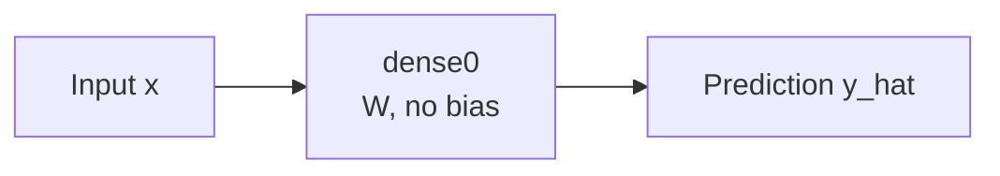

# MDL-DENSE1-LINEAR-NOBIAS-000: One Dense Linear Student

<StatusBadges statuses="valid;inprogress" />
---

## Summary

This is the smallest student model used in the first global-throttle ablations. It has one Dense layer, no activation, and no bias. It is designed to match the linear teacher in [`DS-AFFINE-LINEAR-000`](../datasets/affine-linear-000.md).

| Field | Value |
|---|---|
| Model ID | `MDL-DENSE1-LINEAR-NOBIAS-000` |
| Model family | Dense linear |
| Input dimension | `d_in = 4` |
| Output dimension | `d_out = 2` |
| Layers | 1 Dense |
| Activation | None |
| Bias | Disabled |
| Stable layer name | `dense0` |
| Trainable parameters | `4 x 2 = 8` Keras kernel parameters |

## Forward Pass

The student model computes:

```math
\hat{y} = W x.
```

In Keras Dense storage convention, the kernel has shape:

```math
W_{\mathrm{keras}} \in \mathbb{R}^{d_{\mathrm{in}} \times d_{\mathrm{out}}}.
```

The math convention used in the experiment docs is:

```math
W_{\mathrm{math}} = W_{\mathrm{keras}}^T
\in
\mathbb{R}^{d_{\mathrm{out}} \times d_{\mathrm{in}}}.
```

## Diagram



## Training Role

This model is useful because the one-layer no-bias regression loss has an exact Hessian. That lets the ablation compare:

- analytic stability margin,
- online curvature proxy,
- selected global throttle `alpha_t`,
- quantized update distortion.

## Used By

| Experiment | Role |
|---|---|
| [Experiment 000A-B](../experiments/000-global-throttle-sanity.md) | Float global-throttle sanity check. |
| [Experiment 000C](../experiments/000-global-throttle-sanity-quantization.md) | Quantized global-throttle sanity check. |

## Implementation

Implemented through `LinearBlockModel` with:

```python
LinearBlockModel(
    dataset=dataset,
    num_hidden=[],
    activation=None,
    use_bias=False,
)
```

Reference: [Model implementation](../implementation/nn.md)
