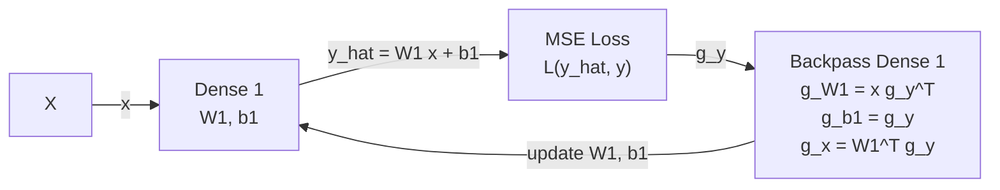

# Experiment 001: Affine Single Dense

Status: Planned  
Owner: Manuel Blanco-Valentin  
Workspace: `workspace/ablations/001_affine_single_dense`

## Goal

Build the smallest possible fixed-point online learning test where the true solution is known, then identify drift regimes where unthrottled fixed-point training saturates, diverges, or stops learning.

The main controller under test is dynamic global throttling:

```text
Delta theta_raw(t) = -eta G(t)
C(t) = ||G(t) - G(t-1)|| / (||theta(t) - theta(t-1)|| + eps)
alpha(t) = clamp(1 / (1 + beta EMA(C(t))), alpha_min, 1)
Delta theta(t) = alpha(t) Delta theta_raw(t)
```

## Model

Dataset:

```text
x ~ U([0, 1]^d)
y = A x + c
```

Student:

```text
y_hat = W1 x + b1
L = mean((y_hat - y)^2)
```

Drift:

```text
x_drift = alpha x + beta
```

## Diagram



## Hypothesis

There is a drift region where the fixed-point baseline fails because activations, gradients, or updates exceed their rails. A single global throttle should stabilize the learning dynamics while preserving update direction, meaning:

```text
cos(Delta_actual, -G) ~= 1
```

Legacy row/column kappa projection is optional in this experiment. Do not spend time rebuilding it unless the dynamic global throttle path is already working and a comparison is needed.

## Planned Procedure

1. Generate an affine teacher system with a fixed random seed.
2. Train a high-precision reference model around `x in [0, 1]`.
3. Simulate fixed-point online training without drift.
4. Sweep `(alpha, beta)` to find where baseline online training fails.
5. Re-run the failure regime with dynamic global throttle.
6. Compare against loose kappa plus throttle and global static kappa scaling.
7. Optionally compare against legacy row/column projection if available.
8. Compare loss, saturation, weight norms, gradient norms, update norms, curvature proxy, `alpha(t)`, Hessian metrics, and update cosine.

## Required Results

| Metric | Description |
|---|---|
| Failure boundary | Drift values where baseline fixed-point training fails. |
| Recovery loss | Final online loss after drift. |
| Saturation count | Counts per tensor and per training phase. |
| Curvature proxy | `C(t)` and its EMA. |
| Global throttle | `alpha(t)` over time. |
| Update cosine | Direction preservation of budgeted update. |
| Hessian metrics | `lambda_max(H)`, `||H||`, `rho(I - eta H)`, and `rho(I - alpha eta H)`. |
| Distance to teacher | `||W1 - A||` and `||b1 - c||` where applicable. |

## Related Documentation

- Site overview: `site/docs/background/overview.md`
- Architecture: `site/docs/implementation/architecture.md`
- Experiment index: `site/docs/experiments/index.md`
